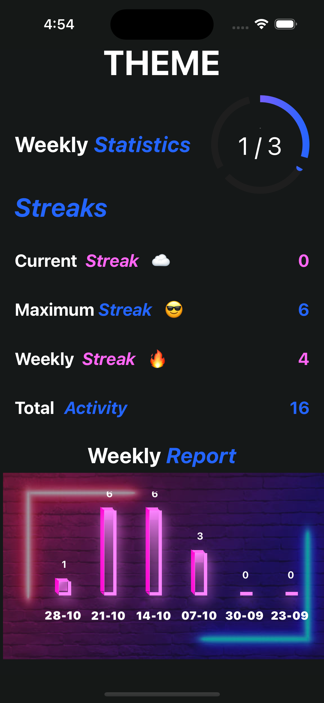
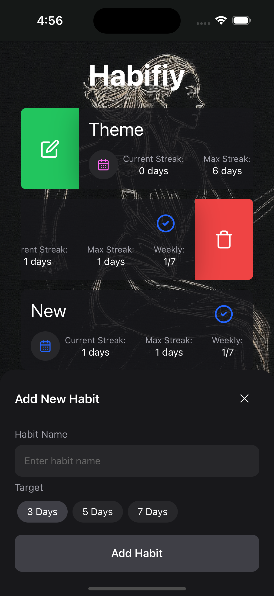

# Habifiy

This is a mobile Application built purely using React Native, Expo, Gluestack, Tailwind, Nativewind

- Every log is stored in Asyncstorage
- Has ability to record CurrentStreak, Maximum Streak, Weekly Streak
- Animations for progress and weekly report

### Beautiful tracking screen of your activity

#### Packages used:

1. react-native-gifted-charts
2. react-native-circular-progress-indicator
3. react-native-gesture-handler ( Swipeable )

### Ability to add, modify, delete ongoing habits

#### Scope of improvement:

- Weekly view heatmap can be added
- Data can be stored in a db instead of asyncstorage
- A login page can be used for authentication
- Logos and names for the application
